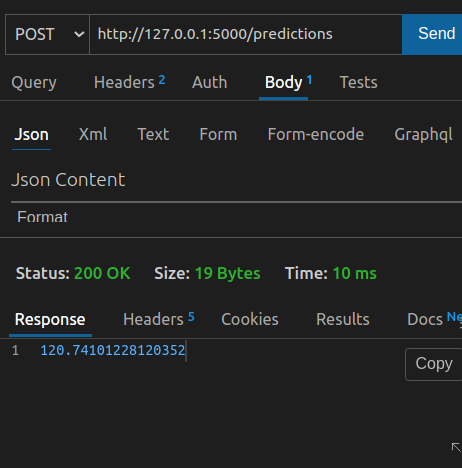

## Machine learning Inplementation using flask

- Create a python virtual environment

```bash
python3 -m venv python_flask_env
```

- Activate environment and Install flask package.

```bash
source python_flask_env/bin/activate
python -m pip install flask
```

- Create a requirements.txt file.

- save packages into requirements.txt

    ```bash
    pip freeze > requirements.txt
    ```

2. Copy model.pkl file into your project directory.

3. Create app.py file

4. Import required packages.

**app.py**

```py
import pickle
from flask import Flask, request, app, jsonify
import numpy as np
import pandas as pd

# start flask app
app = Flask(__name__)


if __name__ == '__main__':
    app.run(debug=True)
```

5. Load the pickle file.

```py
model = pickle.load('model.pkl', 'rb')
```

6. Create an API.

```py
@app.route('/predictions', methods=['POST'])
def predictions():
    pass
```

- request lirabry helps to capture JSON data coming from POSTMAN.

### How to capture JSON data coming from POSTMAN ?

Our request data to sent is given below:

```json
{
    "data": {
        "Frequency": 7.4,
        "Angle of Attack": 0.70,
        "Chord Length": 0.01,
        "Free-Stream Velocity": 1.9,
        "Suction Side": 0.076
    }
}
```

- We need to capture data property from json object.

- We use request library to capture data.

```py
@app.route('/predictions', methods=['POST'])
def predictions():
    data = request.json['data']
    print(data)
```

- Predict the output.

```py
@app.route('/predictions', methods=['POST'])
def predictions():
    data = request.json['data']
    print(data)
    # create a list of dicitonary values
    new_data = [list(data.values())]
    # predict the output using new data.
    output = model.predict(new_data)[0]
    # convert the output to json.
    return jsonify(output)
```

- Run the prediction request in postman/thunder client.

We get the output as below with the predicted response:

 

**Inference:**

The output is 120.

### Predicting batch output from batch inputs.


